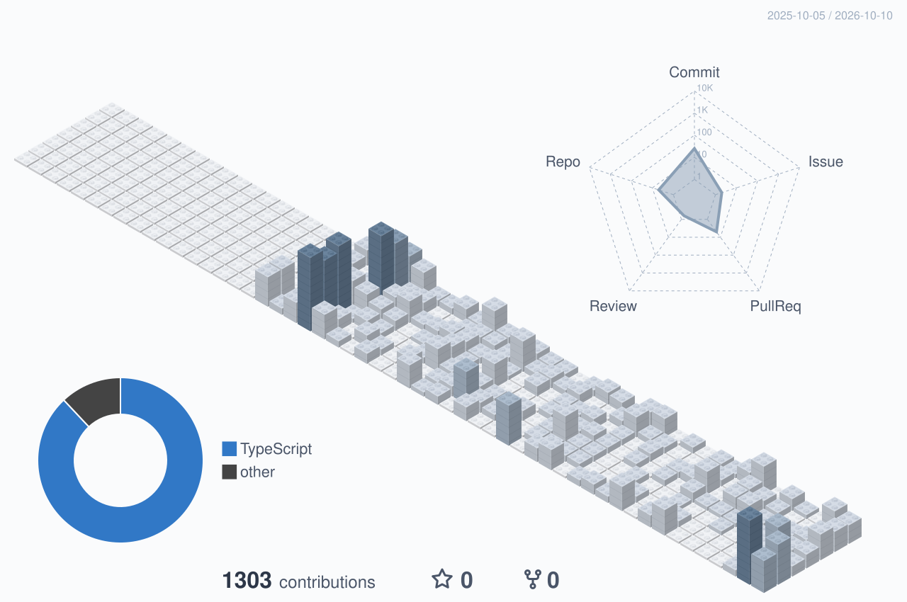

## Status

  
  

---

## Projects

- [Maru — Hair & Life Style](https://higa4yama3.github.io/maru-hair-salon/) — ヘアサロン「maru」の予約サイト
- [あっ、好きな記事をまとめたRSS](https://higa4yama3.github.io/tech-blog-rss-feed/) — 読みたい記事をまとめたBento風RSSフィード

---

## Interests

- AI -- Claude Code, Cursor, Prompt Communication
- Version Control -- Git, [Jujutsu (jj)](https://github.com/jj-vcs/jj)
- Blog RSS Curation

---

## Skills

  
   
  

---

## Contributions

  <picture>
    <source media="(prefers-color-scheme: dark)" srcset="./profile-3d-contrib/profile-gitblock-dark.svg" />
    
  </picture>

